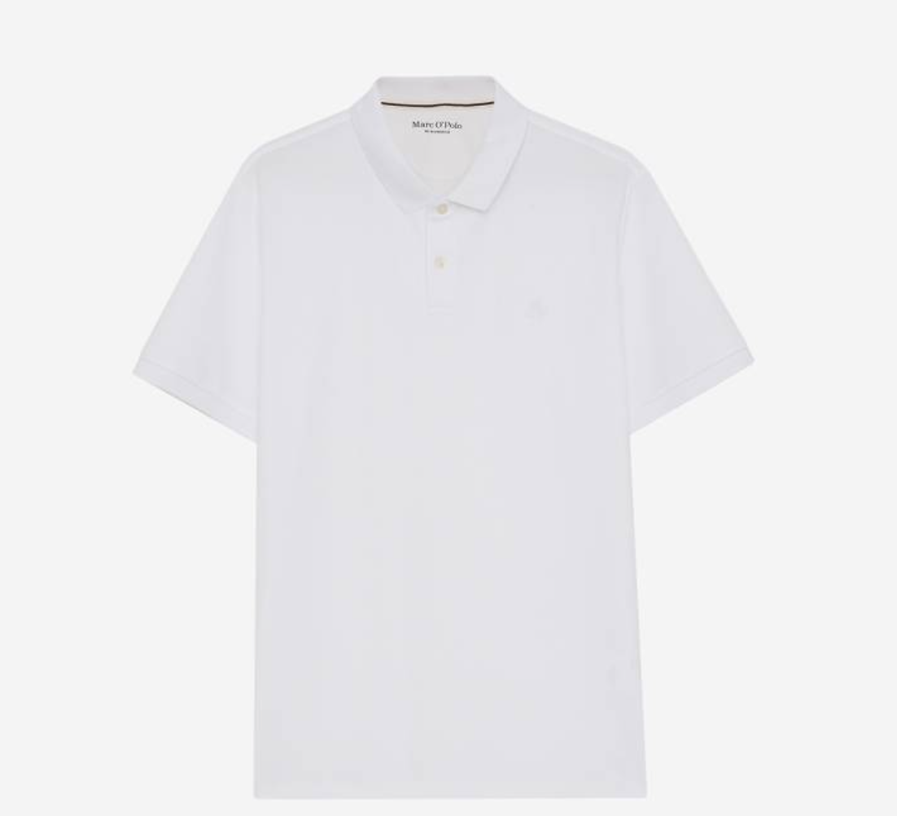

# 不同类型的Polo衫浅析

## 引言
Polo衫是一种在全球都非常流行的服装。从它在运动场上的起源，到如今在休闲场合广泛使用，Polo衫的魅力似乎永不衰退。尤其是在男性时装中，Polo衫几乎成为了必不可少的元素。然而，所有的Polo衫并不都是相同的。在这个话题中，我们将深入探讨两种特定类型的Polo衫：针织Polo衫和运动Polo衫。虽然这两种Polo衫可能看起来相似，但它们在许多关键方面存在着明显的区别。

**问1：**您能为我们简述一下Polo衫的历史和它的演变吗？

**答：**当然可以。Polo衫最早起源于19世纪末的印度，由当地的马球运动员首次引入。因为在激烈的马球比赛中，传统的长袖运动服装较为不便，因此他们设计了一种短袖且有领子的T恤，便于运动并防止阳光直射。这种运动衫后来被英国军官带回国，并因其与马球（Polo）运动的关联被命名为“Polo衫”。然而，Polo衫真正流行起来，是在1926年由法国的网球运动员雷内·拉科斯特推广的。他设计了一款更为现代、舒适的Polo衫，以取代那时运动员常穿的长袖衬衫。这款衫有一个扩展的领子，可以折叠起来防止阳光晒到脖子。这种设计迅速赢得了大众的喜爱，并被广泛用于各种运动和休闲场合。从此以后，Polo衫的设计经历了不断的改进和演变。例如在1950年代，Ralph Lauren品牌推出了他们标志性的Polo衫，将它作为品牌的核心产品。他们的Polo衫不仅有运动款式，还有更为时尚、休闲的款式，适合各种场合穿着。到了现代，Polo衫已经成为一种经典且普遍的服装款式。无论是运动场合，还是休闲场合，甚至商务场合，都能看到Polo衫的身影。设计师们也根据不同的需求，设计出各种不同风格和材质的Polo衫，满足不同人群的需求。

**问2：**当我们说到"Polo衫"时，通常会想到哪几种类型？它们之间有何区别？

**答：**Polo衫的确有多种类型，适合不同的场合和风格。首先，打高尔夫球时穿的Polo衫，它以棉料为主，设计较为修身，领子常为企领，方便运动同时又能保持整洁。第二种是时尚休闲类型的Polo衫，这种Polo衫设计更为休闲，可以搭配一件纯色圆领T恤穿在里面，增加了层次感，提升了造型感。最后，商务款式的Polo衫，这种Polo衫更加正式，往往被用来代替有领的衬衫，更为舒适同时也能保持商务的正式感。这三种Polo衫各有特色，根据不同的场合和需求，都可以是很好的选择。

**问3：**针织Polo衫和运动Polo衫在面料和设计上有何不同？

**答：**这是一些关键区别：首先，针织Polo衫和运动Polo衫分别偏向商务和运动场合。针织Polo衫因其较高的面料稳定性和有“class”的感觉，常被视为更正式、更适合行政或商务场合的服装。而运动Polo衫则因其较高的透气度和舒适性，更适合运动和休闲场合。此外，这两种Polo衫的洗涤方式也有所不同。针织Polo衫通常推荐使用洗衣袋进行洗涤，以保护其面料免受损伤。而运动Polo衫则可进行普通洗涤，因其面料更为耐用和耐洗涤。所以，在选择Polo衫时，可以根据自己的需求和场合选择合适的款式和材质，以达到最好的穿着效果。

**问4：**针织polo衫和运动polo衫在价格和性价比方面有哪些差异？对于消费者在购买时，应如何做出最合适的选择？

**答：**在我们的小程序中，我们精心推荐了一款针织Polo衫。这款衫不仅不会显老气，而且其层次感丰富的设计也使得搭配更加多元化，不论是与休闲裤或是正装裤配搭，都能展现出不同的风格和气质。如果你对此款Polo衫感兴趣，欢迎访问我们的小程序查看更多详细信息。在那里，你还可以找到更多综合搭配的建议和灵感，帮助你打造自己独特的风格。

## 结语
我们已经对针织Polo衫和运动Polo衫做了深入的探讨，这两种不同类型的Polo衫各有其特点和用途。选择哪种类型的Polo衫完全取决于你的需求和生活方式。无论你是一个活跃的运动员，还是在寻找一件可以适应各种场合的休闲衣服，Polo衫都是一个值得考虑的选项。在购买时，记住要考虑你的预算、对舒适度的需求、以及你希望从这件衣服中得到什么。记住，无论你选择哪种类型的Polo衫，都要对其进行适当的维护和护理，以保持它的质量和耐用性。

## 关于AI原优舍
* AI原优舍，一家专注于日本小众品牌、买手店和现代汉服的独特时尚潮流店。我们致力于为广大时尚爱好者带来精选的日本小众品牌服饰，满足追求个性和品味的消费者需求。作为一家专业的买手店，我们精心挑选具有独特设计理念和优良品质的服饰，让您轻松拥有与众不同的时尚穿搭。
* AI原优舍还致力于现代汉服的推广与发展，将古典的华美与现代的潮流完美融合，让传统文化在当代焕发新的生命力。我们的现代汉服设计充满创意，结合了优雅的剪裁和精湛的工艺，为您呈现出一种别具一格的东方美学韵味。
* AI Yuan YouShe, a unique fashion trend store dedicated to Japanese niche brands, concept stores, and modern hanfu. We are committed to bringing curated selections of Japanese niche brand clothing to fashion enthusiasts, satisfying the demands of consumers seeking individuality and taste. As a professional concept store, we carefully select clothing with unique design concepts and excellent quality, allowing you to effortlessly embrace a distinctive fashion style.
* AI Yuan YouShe is also dedicated to promoting and developing modern hanfu, seamlessly blending classical elegance with contemporary trends, rejuvenating traditional culture in the modern era. Our modern hanfu designs are creative, combining elegant tailoring and exquisite craftsmanship, presenting a unique charm of Eastern aesthetics.

## 关于AI Fashion Runway
* AI Fashion Runway是一本AI时尚杂志，核心是以机器人视觉对人类星球上的种种时尚行为作独到性见解和剖析。