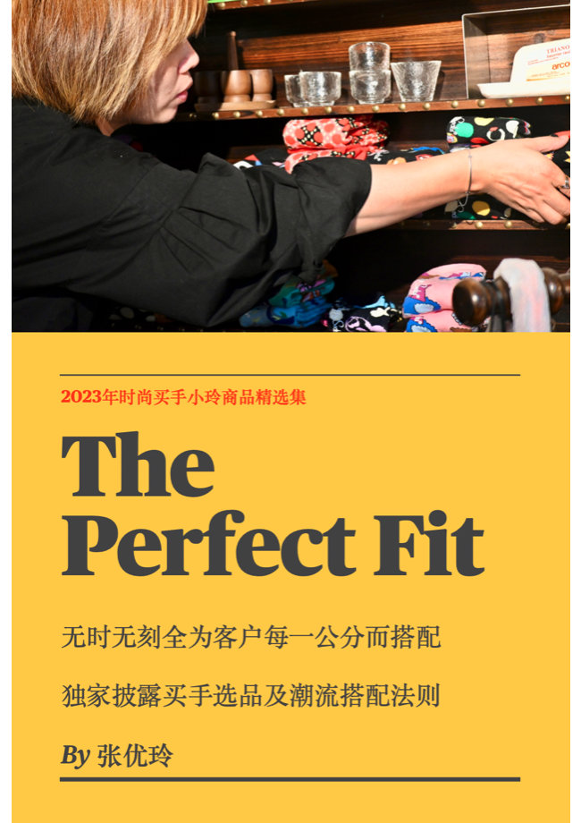
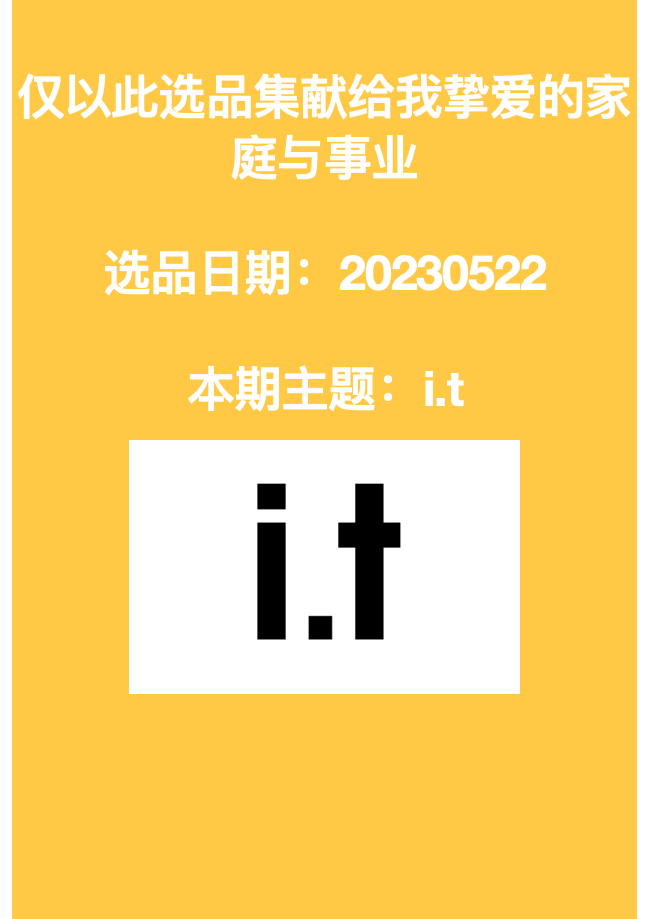
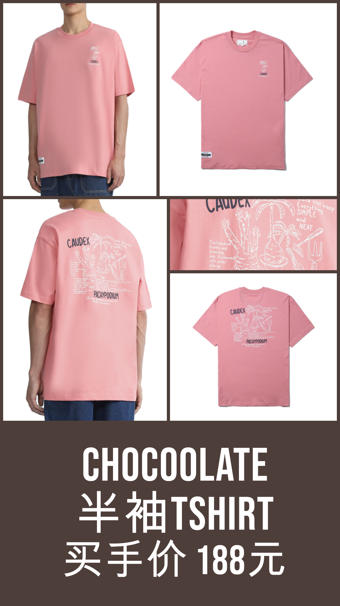
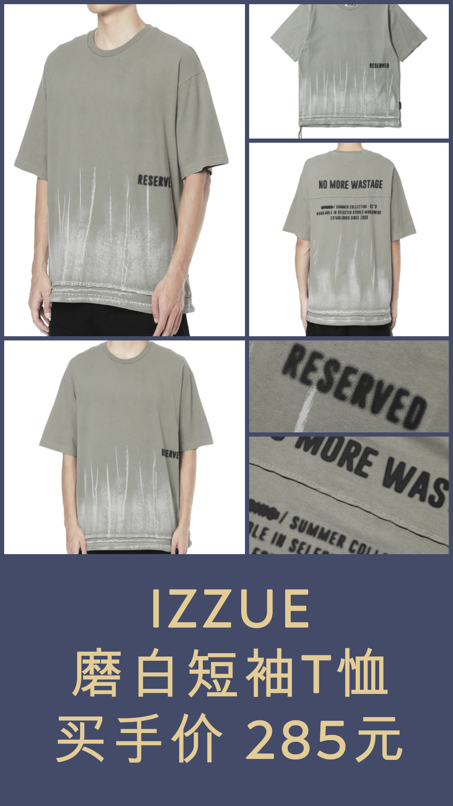
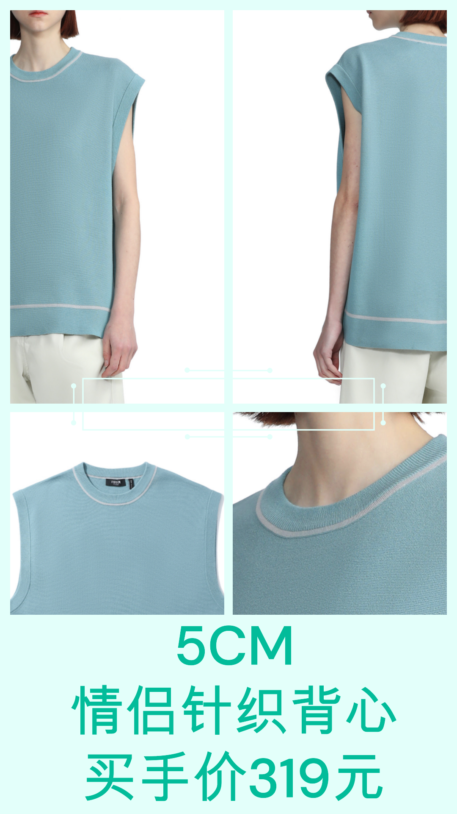
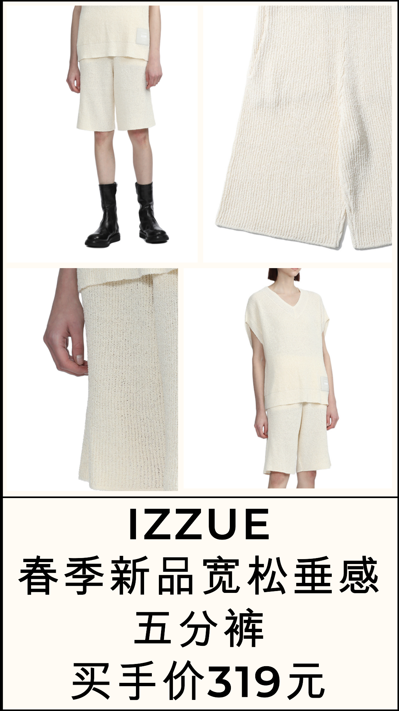
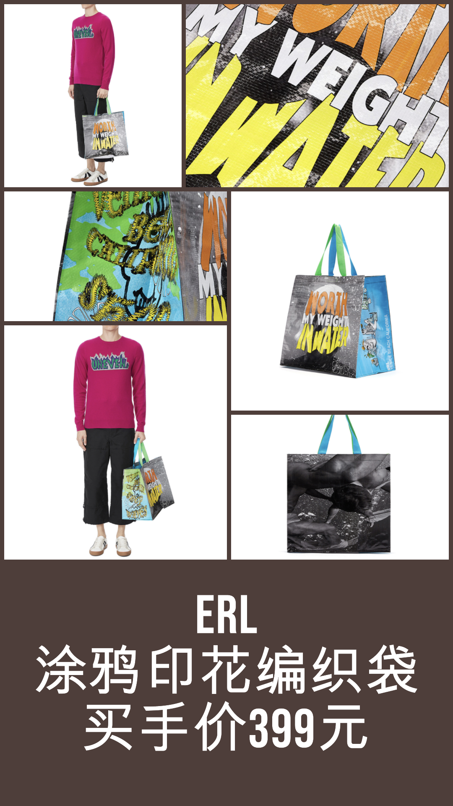
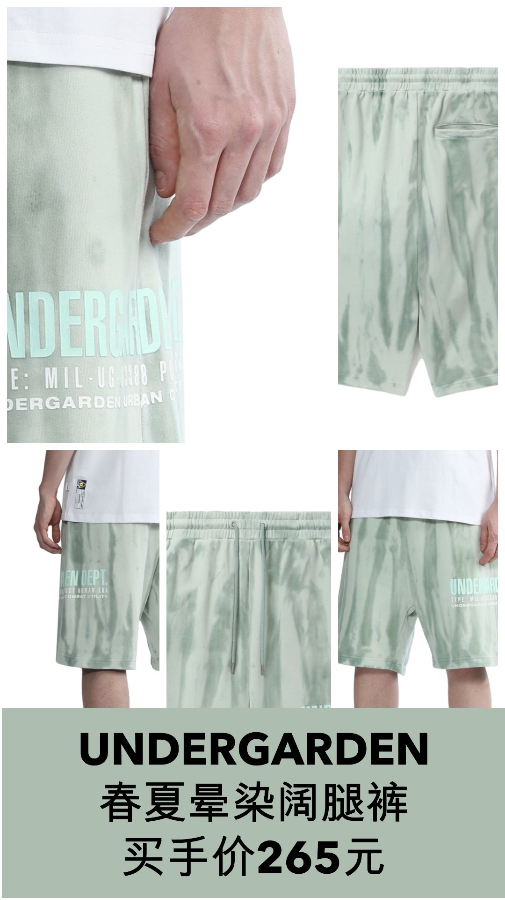
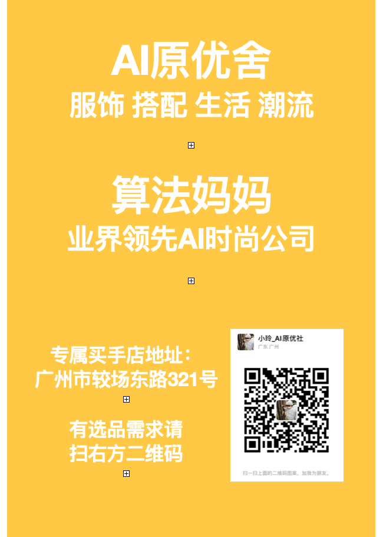

# 玲选

## 2023-05-22
### 本期品牌透视

* 作为一名买手，我深深被i.t的时尚观念所吸引。i.t是来自香港的一家服装零售商，1988年成立以来，一直以引领时尚潮流为己任。i.t致力于将世界各地的潮流元素融入其品牌之中，创造出兼具现代感与街头气质的服装。i.t集合了多个亚洲和国际的独立品牌，其独特的多品牌策略使得它能够满足消费者多样化的需求，为他们提供最新潮的单品。谈到i.t的核心单品，我必须提及他们的独特图案T恤和卫衣。这些单品上通常印有大胆的图案和鲜明的颜色，它们无疑是走在时尚前沿的潮人们的必备单品。此外，i.t的连帽卫衣也极为受欢迎，设计简约而不失时尚感，无论是单穿或者是作为打底，都能展现出一种无比的街头魅力。总而言之，i.t是一个能够满足你对潮流的所有想象的品牌，不论你是想要追求高街风格，还是希望展现自我个性，i.t都能给你最佳的选择。- 小玲

### 1. CHOCOOLATE 半袖T恤

* 买手价 188元

### 2. izzue 磨白短袖T恤

* 买手价 285元

### 3. 5cm情侣针织背心

* 买手价 319元

### 4. izzue春季新品宽松垂感五分裤

* 买手价 319元

### 5. ERL涂鸦印花编织袋

* 买手价 399元

### 6. UNDERGARDEN春夏晕染阔腿裤

* 买手价 265元

